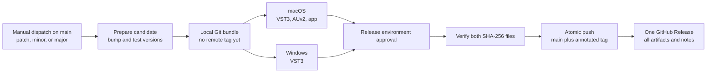

# Release pipeline

## Goal and supported artifacts

Rippr uses one workspace version and one GitHub Release for every production
release. The release contains the complete set of formats currently supported by
the product, including the Worker and pinned acquisition tools each format needs
at runtime.

| Artifact | Runner | Contents | Signing and validation |
| --- | --- | --- | --- |
| `Rippr-vX.Y.Z-macOS-arm64.zip` | `macos-15` (Apple Silicon) | `Rippr.vst3`, `Rippr.component` (AUv2), and `Rippr.app` | Developer ID hardened-runtime signing, `pluginval`, `auval`, Apple notarization, ticket stapling, and `codesign` verification |
| `Rippr-vX.Y.Z-Windows-x64.zip` | `windows-2025` | `Rippr.vst3` | Authenticode SHA-256 signing, RFC 3161 timestamping, and `signtool verify` |
| `SHA256SUMS.txt` | `ubuntu-24.04` | SHA-256 digest for both archives | Recomputed only after both platform jobs succeed |

AUv2 and standalone are macOS formats in this project. The Windows deliverable is
VST3. A future format only belongs in `truce.toml`, CI, packaging, this table, and
the release workflow after it has an explicit host-validation target.

The workflow deliberately publishes ZIP archives instead of asking
`cargo truce package` to build installers. Rippr must inject `rippr-worker`,
`yt-dlp`, FFmpeg, and third-party notices into each completed bundle before the
inside-out signature is applied. The project packaging scripts own that
resource-complete staging process. Native `.pkg` and Inno Setup installers can be
added later as a final wrapper around these already signed bundles.

## Version policy

The manual workflow offers `patch`, `minor`, and `major` choices and updates these
files together:

- `[workspace.package].version` in `Cargo.toml`
- the three workspace package versions in `Cargo.lock`
- `ui/package.json`
- the root package records in `ui/package-lock.json`

Use the increments as follows:

- **Patch**: compatible fixes, packaging fixes, tool refreshes, and small UI polish.
- **Minor**: backward-compatible features, new acquisition behavior, or a newly
  supported host/format.
- **Major**: incompatible persisted-state, automation, preset, or public-library
  changes. The plug-in bundle ID, VST3 CID, AU manufacturer code, and AU fourcc are
  permanent identities and must not change merely because the major version does.

The Rust crates are implementation packages, not a supported crates.io API. This
pipeline versions the entire workspace but does not run `cargo publish`. If
`rippr-core` later becomes a public Rust library, give it an explicit API policy
and add a separate crates.io publication job after the signed artifacts pass.

## Publication architecture

The `prepare` job creates the version commit locally and uploads it as a thin Git
bundle. Both builders consume the exact same candidate commit. Nothing changes on
GitHub until every build, signature, validation, and notarization step succeeds.
The final job then checks that `origin/main` has not moved and atomically pushes
the candidate commit and annotated tag. It is the only job allowed to write
repository contents or create a GitHub Release.

This design prevents a failed notarization or Windows build from consuming a
version number. It also prevents the common multi-platform race where each build
job independently edits the same Release.

## One-time GitHub setup

Create the following Actions repository secrets:

| Secret | Value |
| --- | --- |
| `MACOS_CERTIFICATE_P12_BASE64` | Base64-encoded Developer ID Application `.p12` |
| `MACOS_CERTIFICATE_PASSWORD` | Password used when exporting that `.p12` |
| `MACOS_CODESIGN_IDENTITY` | Full identity, for example `Developer ID Application: Name (TEAMID)` |
| `APPLE_ID` | Apple account used by `notarytool` |
| `APPLE_TEAM_ID` | Apple Developer team ID |
| `APPLE_APP_PASSWORD` | App-specific password used by `notarytool` |
| `WINDOWS_CERTIFICATE_PFX_BASE64` | Base64-encoded Authenticode `.pfx` |
| `WINDOWS_CERTIFICATE_PASSWORD` | Password for the `.pfx` |

The temporary macOS keychain and Windows PFX exist only on their ephemeral hosted
runners and are never uploaded as artifacts. GitHub masks secret values, but the
workflow must still only be edited and dispatched from trusted `main` commits.

Create a GitHub environment named `release` and require at least one reviewer.
Only the final publication job uses this environment, so signing and validation
can finish before a human approves the irreversible tag and Release. The default
`GITHUB_TOKEN` must be allowed to write repository contents, and branch protection
must permit this workflow to fast-forward `main`. Keep the repository's general
workflow token permission read-only; `release.yml` elevates only its final job.

## Running a release

1. Merge the intended changes to `main` and confirm the normal CI workflow is green.
2. In GitHub, open **Actions → Release → Run workflow**.
3. Select `patch`, `minor`, or `major`, enable **Build, sign, and publish**, and run
   it from `main`.
4. Inspect the macOS and Windows build jobs. Approve the `release` environment only
   when both signed artifacts are present and green.
5. Confirm that the resulting GitHub Release contains both ZIP files and
   `SHA256SUMS.txt`, and that `main` and `vX.Y.Z` point to the same release commit.
6. Install the released VST3 in Ableton Live and the AUv2 in GarageBand for the
   release-candidate host smoke pass. Verify editor open/close/reopen, acquisition,
   preview/stop, restore, waveform, native macOS WAV drag, and Reveal fallback.

The workflow generates GitHub release notes from merged changes. Curate the notes
in GitHub after publication when the generated summary needs product-facing copy;
never replace an existing archive or move a published tag.

## Failure and recovery

- A failure before `publish` has no repository mutation. Fix the issue on `main`
  and dispatch the same version increment again.
- If `main` advances while artifacts are building, `publish` refuses to push.
  Dispatch again from the new `main`; the old unsigned candidate is only a
  short-lived Actions artifact.
- If the atomic push succeeds but GitHub Release creation is interrupted, rerun
  the failed `publish` job. It verifies the existing tag and uploads the assets
  that are still missing without replacing an attached archive.
- Once a GitHub Release exists, its tag and archives are immutable. Ship any fix as
  a new patch release rather than deleting, moving, or replacing published bits.

## Follow-up roadmap

1. Add Intel macOS or a universal binary only when its FFmpeg/Worker architecture
   and host matrix are tested; do not relabel an arm64 build as universal.
2. Wrap the signed payloads in a notarized macOS `.pkg` and signed Windows installer.
3. Add Windows native WAV drag when it has a host-tested implementation; Reveal is
   the fallback until then.
4. Add release-channel inputs for prereleases only when beta distribution is real.
5. Add an SBOM and GitHub artifact attestations after verifying that provenance is
   bound to the local release-candidate commit rather than the dispatch base SHA.
